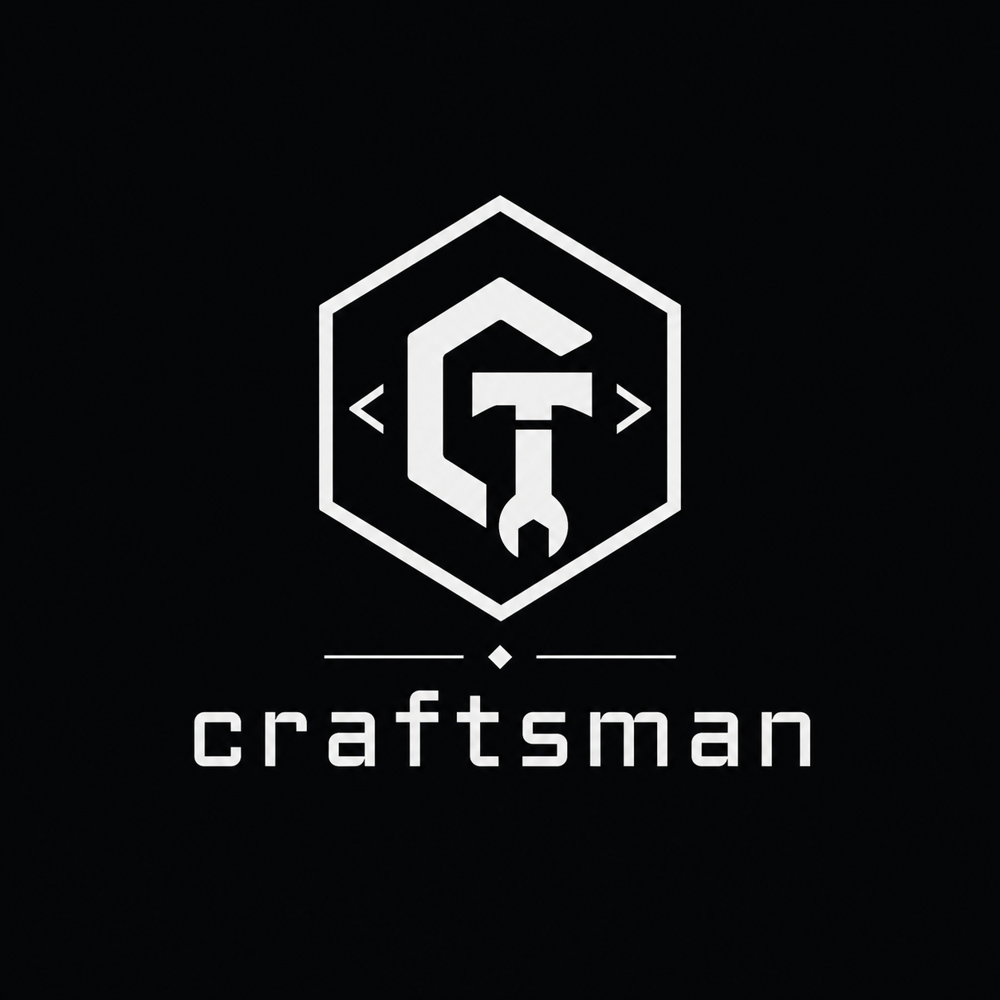
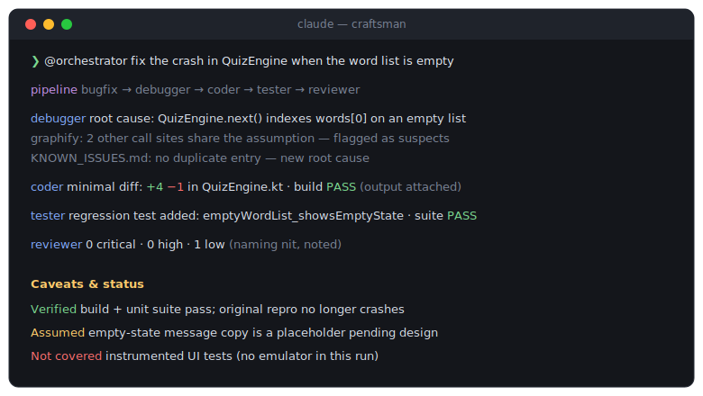

<p align="center">
  
</p>

# craftsman — Claude Code plugin marketplace

<p align="center">
  <a href="https://github.com/bufferBrew/craftsman/actions/workflows/validate.yml"></a>
  <a href="./craftsman-plugin/.claude-plugin/plugin.json"></a>
  <a href="https://code.claude.com/docs/en/plugin-marketplaces"></a>
  <a href="./LICENSE"></a>
</p>

**craftsman** makes engineering discipline the default in [Claude Code](https://code.claude.com):
the smallest correct change, no fix without a root cause, and an honest report of what was
actually verified. It bundles ten agents, seven skills, two slash commands, and a cross-platform
hook system — installable in two commands.

<p align="center">
  
</p>

## Install

```
claude plugin marketplace add bufferBrew/craftsman
claude plugin install craftsman@craftsman
```

Or from inside a Claude Code session:

```
/plugin marketplace add bufferBrew/craftsman
/plugin install craftsman@craftsman
```

Restart Claude Code (or start a new session) after installing, then run `/craftsman:init` in any
project to get started.

## What you get

| Problem | Before | With craftsman |
|---|---|---|
| Choosing the right agent pipeline | Trial-and-error chaining of agents | `@orchestrator` classifies the task, picks the minimal pipeline, and gates each stage on fresh evidence |
| Diffs grow beyond the request | "Fixed it" — plus an uninvited refactor of three other files | **Minimal-diff coding** — the smallest change that solves the problem; anything extra needs your OK first |
| The same bug returns under a new name | Symptom patched, root cause untouched | **Root-cause debugging** — no fix without an established root cause; a [graphify](https://pypi.org/project/graphifyy/) knowledge graph catches recurring bugs before they're filed as new ones |
| Finding relevant code takes forever | Raw grep through files | Query the graphify graph first — hooks nudge every grep/find toward it in graphed projects |
| Environment quirks rediscovered every session | Same OS/shell/tool failure re-derived by trial and error | **Environment-quirk memory** — discovered once, recorded, never re-derived |
| Scaffolding writes files you didn't ask for | Surprise `CLAUDE.md` and config files | **Ask-before-writing** — `/craftsman:init` proposes exact file content and waits for confirmation |
| "Done!" but nothing was actually run | Claims without evidence | **Honest completion** — every nontrivial task ends with a Verified / Assumed / Not covered status block |

## Common problems this solves

### Claude Code minimal diff

If "fix the off-by-one" comes back as a fix plus renamed variables and a reformatted file, that's
what the `smallest-change-first` skill and the `coder` agent's minimal-diff discipline are for:
anything beyond the literal request needs your OK first. See
[use case #1](./docs/use-cases.md#1-every-fix-comes-back-with-a-bonus-refactor).

### Claude Code keeps refactoring instead of fixing

A one-line ask shouldn't turn into a drive-by refactor of three unrelated files. craftsman's
`coder` agent runs a seven-step ladder before writing anything new (does it need to exist? already
in the codebase? stdlib? platform feature? existing dependency? one line?) and stops there unless
you say otherwise.

### Claude Code says done but didn't test

"Done!" followed by a crash on the first real run usually means the build was never actually
executed. The `caveats-and-status` skill ends every nontrivial task with a fixed
Verified / Assumed / Not covered block, and orchestrator pipeline gates require fresh build/test
output at each stage — not a claim that it passed. See
[use case #4](./docs/use-cases.md#4-done--but-nothing-was-actually-verified).

### Claude Code re-fixes the same bug under a new name

When a null-check bug fixed in `OrderService` resurfaces in `InvoiceService` two months later,
nobody usually connects the two. With a [graphify](https://pypi.org/project/graphifyy/) graph in
the project, the `debugger` agent queries it before grepping and checks new bugs against
`KNOWN_ISSUES.md` for a resolved match — surfacing the original fix to reuse instead of
re-deriving it. See
[use case #2](./docs/use-cases.md#2-the-same-bug-keeps-getting-filed-as-a-new-one).

## Documentation

- [Full plugin reference](./craftsman-plugin/README.md) — agents, skills, commands, hooks,
  installation options, troubleshooting.
- [Use cases](./docs/use-cases.md) — worked scenarios showing when each piece earns its keep.
- [Results](./docs/results.md) — real, verifiable before/after evidence, honestly scoped to what exists so far.
- [Contributing](./CONTRIBUTING.md) — how to add agents/skills, validate, and test hooks.
- [Changelog](./CHANGELOG.md)

## License

[MIT](./LICENSE)

---

<p align="center">
  If craftsman saves you a debugging session, a ⭐ helps others find it.
</p>
